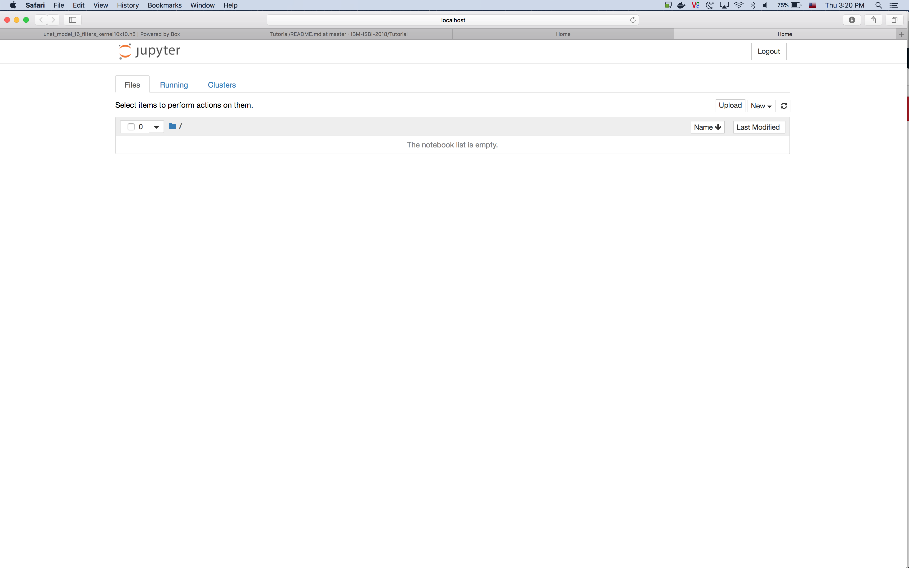

# Tutorial
ISBI 2018 Tutorial on CXR Anatomy Segmentation

- Intro to UNet (e.g keras layers in UNet, modelling, slides for UNet)
- Generators + Augmentation + Loading Data
- Training/Validation through generator 
- Callbacks (e.g. DICE score)
- Visualization

# Instructions

### Requirements
- A computer Ubuntu/Mac/Windows operating system
- High-speed internet access to download packages and repository (contains images)
- Python 3.6 or 2.7
- VirtualEnv (see Linux/Mac instructions: https://virtualenv.pypa.io/en/stable/installation/, see example Windows instructions: http://timmyreilly.azurewebsites.net/python-pip-virtualenv-installation-on-windows/)

### Installation Steps

1. Git clone this Github repository to a desired location on your local hard disk e.g. `~/Desktop/Tutorial/` . If you don't know how to git clone follow these instructions: https://help.github.com/articles/cloning-a-repository/
2. Download the following UNet model files into the previous folder  e.g. `~/Desktop/Tutorial/` : https://ibm.box.com/s/ane1j8h4g2ra1rookny1jz7gxwnjodxw , https://ibm.box.com/s/bh4dik59b3h37t184eidmtnmuxt3a2o8
3. Create a VirtualEnv (e.g. `ISBI-Tutorial-Environment`) . To learn how to create one see more here: https://virtualenv.pypa.io/en/stable/userguide/#usage
4. Activate your new VirtualEnv. To learn how to activate one see more here: https://virtualenv.pypa.io/en/stable/userguide/#activate-script
5. Now that you are inside your virtual environment go to the folder where you cloned the repository e.g. `>cd ~/Desktop/Tutorial/`
6. From the terminal run `pip3 install -r requirements.txt` if your VirtualEnv is running Python3 or  `pip install -r requirements.txt` for Python2 to install the libraries. That might take a few minutes.
7. Once finished, make sure Keras/Tensorflow work (see figure below)

8. Run `jupyter notebook` and your browser will automatically open with Jupyter Notebook pointing to the `Tutorial` folder (see figure below)

